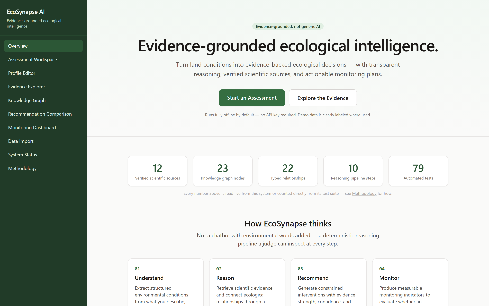
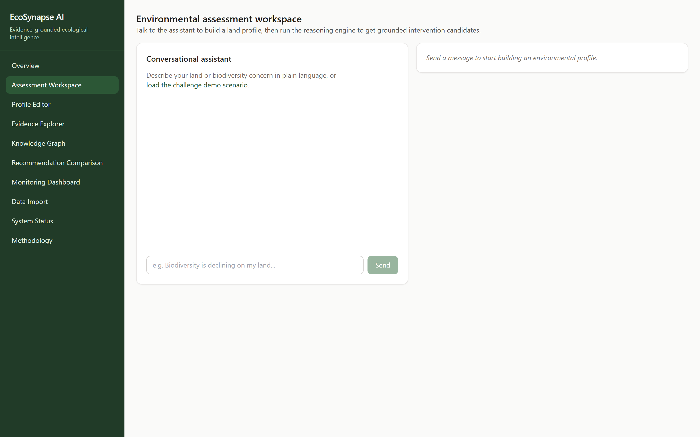
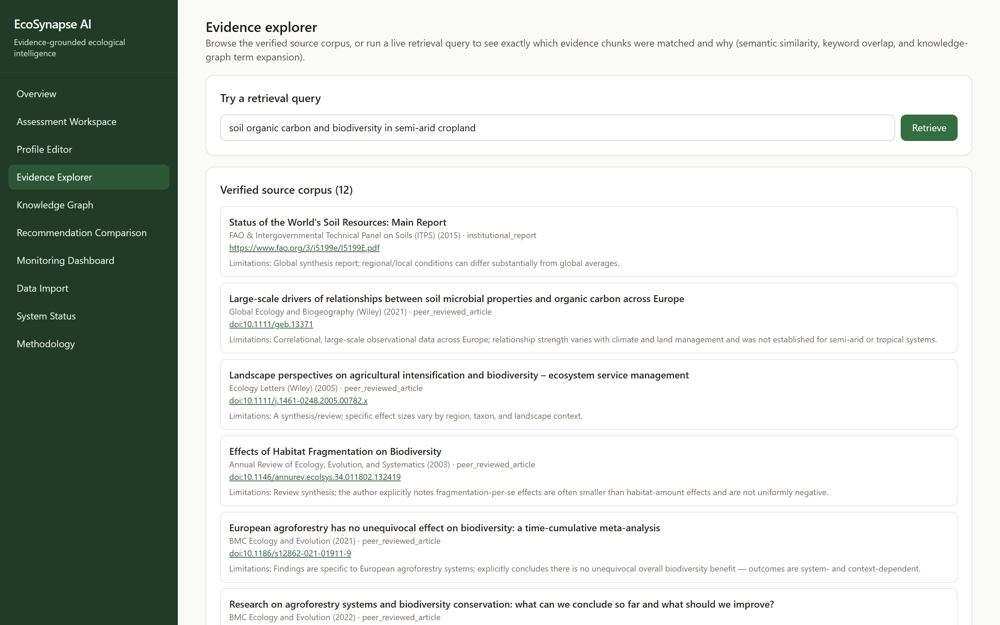
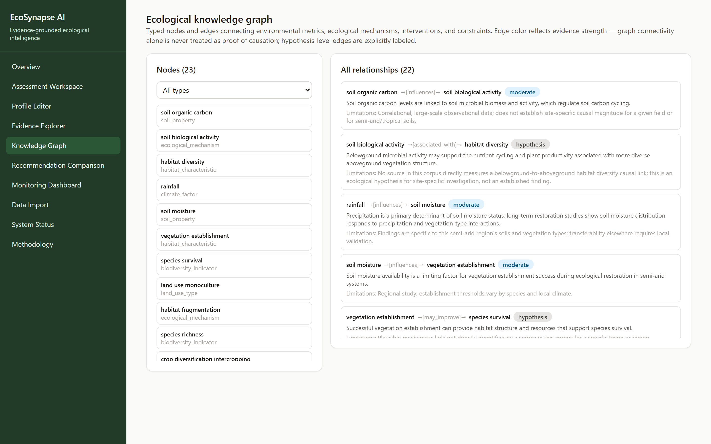
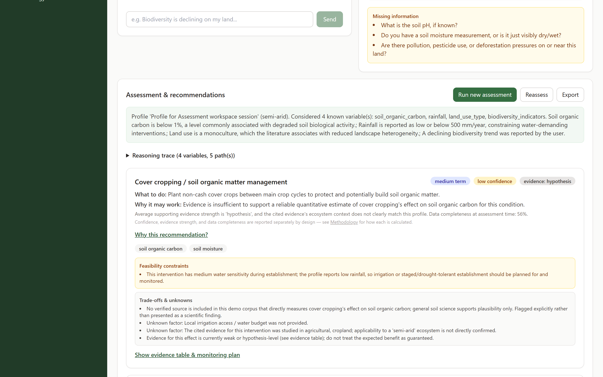
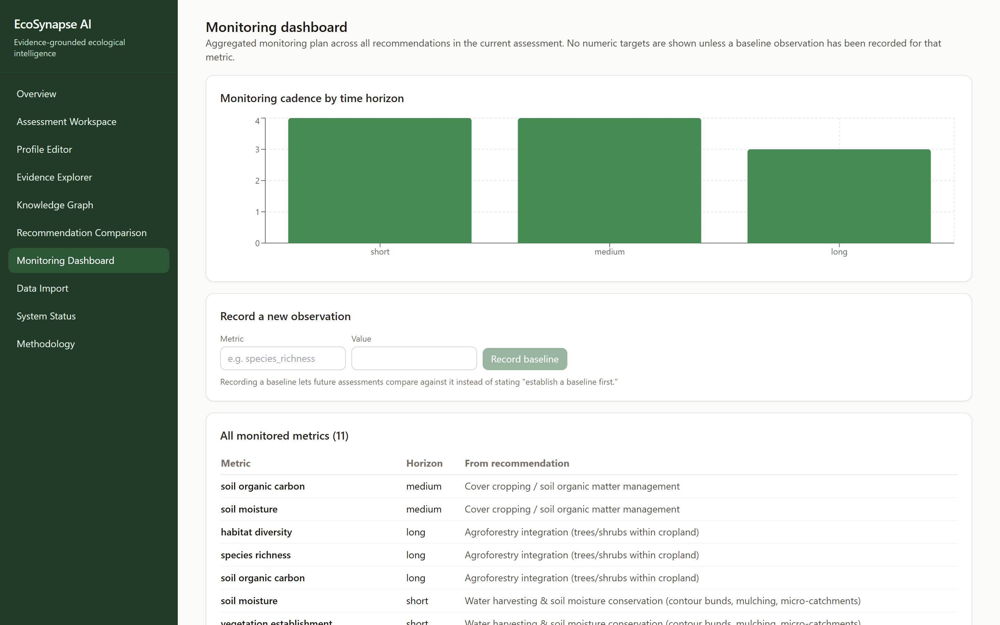

# EcoSynapse AI

## Tagline
**Evidence-grounded ecological intelligence.**

[](https://github.com/daanialmirza5/EcoSynapse-AI/actions/workflows/ci.yml)
[](LICENSE)
[](#testing)
[](https://www.python.org/)
[](https://fastapi.tiangolo.com/)
[](https://react.dev/)
[](https://www.typescriptlang.org/)
[](docker-compose.yml)

---

## One-line description
An evidence-grounded ecological decision-support system that transforms complex land and climate conditions into verified, constraint-aware biodiversity interventions with transparent reasoning chains and structured monitoring plans.

---

## Overview

### The Problem
Traditional large language model chatbots generate fluid, plausible-sounding ecological advice but frequently suffer from hallucinations, fabricated citations, unverified numbers, and an inability to account for physical constraints (such as water scarcity in semi-arid zones or soil acidification thresholds). In real-world ecological restoration, ill-suited interventions waste critical resources and can cause irreversible ecosystem degradation.

### The Solution
**EcoSynapse AI** is an evidence-backed decision-support system built for the **Darukaa.Earth AI Biodiversity Intelligence Chatbot Challenge**. Rather than delegating ecological reasoning to an unconstrained generative model, EcoSynapse uses a **100% deterministic Python reasoning pipeline** backed by a verified scientific knowledge base and a typed ecological knowledge graph.

### Why Evidence-Grounded Reasoning Matters
Every candidate intervention generated by EcoSynapse is explicitly:
1. **Grounded in Peer-Reviewed Literature**: Mapped directly to verified scientific papers and institutional reports with actual DOIs and URLs.
2. **Constrained by Real-World Physics & Ecology**: Evaluated against water sensitivity, soil conditions, and ecological incompatibilities.
3. **Fact-Checked at the Claim Level**: Every quantitative and qualitative statement is verified against the source text.
4. **Actionable & Measurable**: Paired with an automated, non-fabricated monitoring framework across specific time horizons.

### What the System Produces
- **Structured Environmental Profiles**: Parsed without LLM guessing from natural language and structured observations.
- **Evidence-Backed Recommendations**: Detailing the intervention, underlying mechanism, impacted metrics, feasibility constraints, and trade-offs.
- **Claim-Level Evidence Tables**: Providing explicit source citations, excerpts, conditions, and evidence-strength ratings (`strong`, `moderate`, `weak`, `hypothesis`).
- **Comprehensive Monitoring Plans**: Specifying metric baselines, measurement frequencies, and target time horizons.

---

## Key Features

- **Deterministic Environmental Extraction**: Regex- and rule-based extraction parses numbers, percentages, soil types, and climate conditions with zero numeric hallucination.
- **Clarification Question Engine**: Dynamically identifies missing or conflicting variables and generates targeted, high-value clarifying questions before recommending actions.
- **Hybrid Evidence Retrieval**: Combines cosine similarity over chunk embeddings, lexical keyword matching, and knowledge-graph 1-hop term expansion with weighted reranking.
- **Knowledge Graph Reasoning**: Traverses a 23-node, 22-edge typed ecological graph to uncover non-obvious mechanistic connections.
- **Constraint-Aware Decision Engine**: Automatically enforces environmental feasibility filters (e.g., flagging water-demanding interventions in low-rainfall environments).
- **Claim Verification Engine**: Validates every generated recommendation claim against the raw excerpt in the knowledge base, ensuring numeric figures strictly match cited evidence.
- **Multi-Dimensional Confidence Labeling**: Independently reports data completeness, average evidence strength, and overall recommendation confidence.
- **Time Horizon & Impact Mapping**: Categorizes interventions into short-term, medium-term, and long-term ecological trajectories.
- **Automated Monitoring Plans**: Generates metric-specific monitoring schedules and indicators without fabricating false target baselines.
- **Evidence Explorer**: Interactive UI to inspect the 12 curated scientific sources and run real-time hybrid retrieval queries with relevance breakdown.
- **Knowledge Graph Visualizer**: Browse typed ecological nodes, directional edges, mechanisms, and limitations.
- **Recommendation Comparison**: Side-by-side comparison across intervention types, impacted indicators, and evidence tiers.
- **Monitoring Dashboard**: Aggregates monitoring cadences and metric schedules across all active recommendations.

---

## Five Ecological Domains

EcoSynapse AI models interconnected relationships across all five mandatory ecological domains:

```
                  ┌─────────────────────────────────┐
                  │          Climate Factors         │
                  │   (rainfall, temperature)       │
                  └────────────────┬────────────────┘
                                   │ influences
                                   ▼
┌──────────────────────┐  influences   ┌──────────────────────┐
│    Soil Health       │──────────────>│ Habitat Structure &  │
│ (SOC, pH, moisture,  │               │ Fragmentation        │
│ microbial activity)  │<──────────────│ (Land Use / Cropland)│
└──────────┬───────────┘  associated   └──────────┬───────────┘
           │                                      │
           │ supports                             │ may reduce / improve
           ▼                                      ▼
┌─────────────────────────────────────────────────────────────┐
│                   Biodiversity Indicators                   │
│   (species richness, pollinator abundance, soil biology)    │
└──────────────────────────────┬──────────────────────────────┘
                               │
                               │ impacts
                               ▼
                  ┌─────────────────────────┐
                  │      Human Impact       │
                  │ (pesticides, land use,  │
                  │  deforestation)         │
                  └─────────────────────────┘
```

1. **Soil Health**: Soil organic carbon (SOC), soil pH, soil moisture dynamics, microbial respiration, and biological activity.
2. **Land Use**: Intensive monoculture vs. polyculture, crop diversification, agroforestry integration, and buffer strips.
3. **Biodiversity Indicators**: Species richness, beneficial arthropod abundance, natural predator density, and pollinator activity.
4. **Climate**: Precipitation levels, semi-arid and drought pressures, temperature regimes, and climate-induced range shifts.
5. **Human Impact**: Chemical pesticide pressures, agricultural intensification, deforestation, and non-target organism hazards.

---

## How It Works

```
┌──────────────────────────────────────────────────────────────────────────┐
│                             USER INPUT                                   │
│       Natural language description and/or structured measurements        │
└────────────────────────────────────┬─────────────────────────────────────┘
                                     │
                                     ▼
┌──────────────────────────────────────────────────────────────────────────┐
│                   ENVIRONMENTAL FACT EXTRACTION                          │
│     Deterministic regex & rule parser (no LLM hallucination of numbers)  │
└────────────────────────────────────┬─────────────────────────────────────┘
                                     │
                                     ▼
┌──────────────────────────────────────────────────────────────────────────┐
│                   CLARIFYING QUESTION ENGINE                             │
│       Detects data gaps and asks high-value clarifying questions         │
└────────────────────────────────────┬─────────────────────────────────────┘
                                     │
                                     ▼
┌──────────────────────────────────────────────────────────────────────────┐
│                 HYBRID EVIDENCE RETRIEVAL & KG EXPANSION                 │
│      Semantic search + Lexical search + Knowledge graph 1-hop expansion  │
└────────────────────────────────────┬─────────────────────────────────────┘
                                     │
                                     ▼
┌──────────────────────────────────────────────────────────────────────────┐
│               DETERMINISTIC 10-STEP REASONING PIPELINE                   │
│      Discovers ecological mechanisms connecting concerns to solutions    │
└────────────────────────────────────┬─────────────────────────────────────┘
                                     │
                                     ▼
┌──────────────────────────────────────────────────────────────────────────┐
│                   CONSTRAINT & FEASIBILITY CHECKING                      │
│     Filters candidates against water limits, soil pH, and land bounds    │
└────────────────────────────────────┬─────────────────────────────────────┘
                                     │
                                     ▼
┌──────────────────────────────────────────────────────────────────────────┐
│                     CLAIM & CITATION VERIFICATION                        │
│   Checks statements and numbers against source excerpts; labels strength │
└────────────────────────────────────┬─────────────────────────────────────┘
                                     │
                                     ▼
┌──────────────────────────────────────────────────────────────────────────┐
│                    STRUCTURED RECOMMENDATIONS                            │
│    What to do, why it works, impacted metrics, confidence, trade-offs    │
└────────────────────────────────────┬─────────────────────────────────────┘
                                     │
                                     ▼
┌──────────────────────────────────────────────────────────────────────────┐
│                      ACTIONABLE MONITORING PLAN                          │
│    Indicator metrics, baseline requirements, and measurement frequencies │
└──────────────────────────────────────────────────────────────────────────┘
```

---

## Why It Is Not Just a Chatbot

- **Deterministic Python Engine**: The entire reasoning pipeline—extraction, graph traversal, constraint evaluation, claim verification, and monitoring generation—is implemented in deterministic Python code. It is fully unit-tested, reproducible, and verifiable.
- **LLM is Optional & Constrained**: If an external LLM is enabled (`LLM_PROVIDER=openai`), it is strictly used as an optional text-rephrasing assistant for natural language tone. It **never originates factual claims, ecological metrics, citations, or numbers**.
- **No Fabricated Citations**: Citations are queried directly from the verified database corpus containing real papers with valid DOIs and FAO reports. If no source supports a relationship, it is explicitly flagged as a `hypothesis` or `model_derived`.
- **Transparent Evidence Limits**: Unlike generic LLMs that give confident answers even with insufficient data, EcoSynapse transparently reports evidence limits (such as Mupepele et al. 2021 showing that European agroforestry has no unequivocal overall biodiversity benefit).

---

## System Architecture

```
                                  ┌───────────────────────────────┐
                                  │   React 18 + TypeScript SPA   │
                                  │   (Tailwind CSS, Vite, Query) │
                                  └───────────────┬───────────────┘
                                                  │
                                                  │ HTTP REST (JSON)
                                                  │ /api/v1/*, /health
                                                  ▼
                                  ┌───────────────────────────────┐
                                  │        FastAPI Backend        │
                                  │   (Async Python, Pydantic)    │
                                  └───────┬───────────────┬───────┘
                                          │               │
                 ┌────────────────────────┘               └────────────────────────┐
                 ▼                                                                 ▼
  ┌──────────────────────────────┐                                  ┌──────────────────────────────┐
  │     Conversation Engine      │                                  │       Reasoning Engine       │
  │ • Regex Variable Extraction  │                                  │ • Concern Detection          │
  │ • Missing Factor Detection   │                                  │ • Candidate Generation       │
  │ • Clarifying Questions       │                                  │ • Constraint Engine          │
  └──────────────┬───────────────┘                                  │ • Claim Verification         │
                 │                                                  │ • Monitoring Plan Builder    │
                 │                                                  └──────────────┬───────────────┘
                 │                                                                 │
                 └────────────────────────┐               ┌────────────────────────┘
                                          ▼               ▼
                                  ┌───────────────────────────────┐
                                  │   Hybrid Retrieval Pipeline   │
                                  │ • TF-IDF Hashing / OpenAI     │
                                  │ • Lexical Keyword Matcher     │
                                  │ • Multi-Hop Graph Expansion   │
                                  └───────┬───────────────┬───────┘
                                          │               │
                 ┌────────────────────────┘               └────────────────────────┐
                 ▼                                                                 ▼
  ┌──────────────────────────────┐                                  ┌──────────────────────────────┐
  │   SQLAlchemy 2.0 Database    │                                  │   NetworkX Knowledge Graph   │
  │ • PostgreSQL (Production)    │                                  │ • 23 Typed Biological Nodes  │
  │ • SQLite (Offline Dev / CI)  │                                  │ • 22 Directional Edges       │
  │ • Alembic Migrations         │                                  │ • Evidence-Strength Weighted │
  └──────────────────────────────┘                                  └──────────────────────────────┘
```

---

## Knowledge Base

The repository includes a curated seed corpus of **12 verified scientific sources** spanning peer-reviewed journals and international agency reports across all 5 mandatory domains:

| ID | Title | Source / Organization | Year | DOI / URL | Key Topic |
|---|---|---|---|---|---|
| `s1` | Status of the World's Soil Resources | FAO & ITPS | 2015 | [FAO Link](https://www.fao.org/3/i5199e/I5199E.pdf) | Global soil organic carbon decline & soil health |
| `s2` | Large-scale drivers of microbial properties & SOC | Global Ecology & Biogeography | 2021 | [10.1111/geb.13371](https://doi.org/10.1111/geb.13371) | Microbial biomass & carbon cycling relationships |
| `s3` | Agricultural intensification & landscape heterogeneity | Ecology Letters | 2005 | [10.1111/j.1461-0248.2005.00782.x](https://doi.org/10.1111/j.1461-0248.2005.00782.x) | Habitat complexity, pollination & pest control |
| `s4` | Effects of Habitat Fragmentation on Biodiversity | Ann. Rev. Ecol. Evol. Syst. | 2003 | [10.1146/annurev.ecolsys.34.011802.132419](https://doi.org/10.1146/annurev.ecolsys.34.011802.132419) | Fragmentation vs. habitat amount synthesis |
| `s5` | European agroforestry has no unequivocal effect on biodiversity | BMC Ecology and Evolution | 2021 | [10.1186/s12862-021-01911-9](https://doi.org/10.1186/s12862-021-01911-9) | Meta-analysis of agroforestry biodiversity outcomes |
| `s6` | Agroforestry systems and biodiversity conservation | BMC Ecology and Evolution | 2022 | [10.1186/s12862-022-01977-z](https://doi.org/10.1186/s12862-022-01977-z) | Methodological heterogeneity in agroforestry |
| `s7` | Pesticides and Soil Invertebrates: A Hazard Assessment | Frontiers in Env. Science | 2021 | [10.3389/fenvs.2021.643847](https://doi.org/10.3389/fenvs.2021.643847) | Chemical hazard on non-target soil invertebrates |
| `s8` | Climate change & global redistribution of biodiversity | Science | 2017 | [10.1126/science.aai9214](https://doi.org/10.1126/science.aai9214) | Species range shifts under warming climates |
| `s9` | Long-Term Vegetation Restoration & Soil Moisture | Forests (MDPI) | 2023 | [10.3390/f14020295](https://doi.org/10.3390/f14020295) | Semi-arid deep soil moisture & restoration limits |
| `s10` | Tropical Deforestation & Wildlife Trade Pressures | Nature Communications | 2020 | [10.1038/s41467-020-14389-5](https://doi.org/10.1038/s41467-020-14389-5) | Compounding biodiversity pressures in tropical forests |
| `s11` | Soil pH and Microbial Biodiversity Regulation | Applied & Env. Microbiology | 2006 | [10.1128/AEM.02876-05](https://doi.org/10.1128/AEM.02876-05) | Soil pH as a key driver of bacterial community structure |
| `s12` | Intercropping Enhances Beneficial Arthropod Biodiversity | Agriculture, Ecosystems & Env. | 2021 | [10.1016/j.agee.2021.107563](https://doi.org/10.1016/j.agee.2021.107563) | 63-study meta-analysis on pest predators & richness |

---

## Knowledge Graph

- **23 Biological Nodes**: Covering soil properties (`soil_organic_carbon`, `soil_ph`, `soil_moisture`), climate factors (`rainfall`, `temperature`), land use types (`land_use_monoculture`), human pressures (`pesticide_use`, `deforestation`), mechanisms (`soil_biological_activity`, `habitat_fragmentation`, `species_range_shift`), biodiversity indicators (`species_richness`, `beneficial_arthropod_abundance`, `species_survival`), interventions (`agroforestry`, `cover_cropping_soil_organic_matter_management`, `crop_diversification_intercropping`, `native_hedgerow_habitat_strips`, `integrated_pest_management`, `water_harvesting_soil_moisture_conservation`), and constraints (`water_scarcity_constraint`).
- **22 Directional Typed Edges**: Defined with explicit relational types (`influences`, `constrains`, `may_improve`, `may_reduce`, `supports`, `associated_with`), conditions, limitations, and evidence-strength ratings.
- **Multi-Hop Traversal**: Built dynamically via `NetworkX` to support graph-expanded retrieval queries and structural reasoning without stale cache anomalies.

---

## Deterministic Reasoning

The reasoning engine (`apps/api/app/reasoning/engine.py`) operates through a 10-step deterministic pipeline:

1. **Profile Analysis**: Ingests the structured `EnvironmentalProfile` and observations.
2. **Concern Identification**: Detects active ecological concerns (e.g., low SOC, water deficit, pesticide pressure, habitat loss).
3. **Graph Traversal**: Identifies candidate intervention paths connecting concerns to candidate solutions.
4. **Context Matching**: Filters candidates based on ecosystem alignment (e.g., temperate vs. semi-arid applicability).
5. **Constraint Evaluation**: Evaluates physical constraints (e.g., rainfall < 500mm triggers water scarcity constraints on woody vegetation).
6. **Claim Assembly**: Gathers all scientific assertions, mechanisms, and conditions for candidate actions.
7. **Claim Verification**: Performs strict text-match and numeric verification against source corpus excerpts.
8. **Evidence Strength & Confidence Scoring**: Calculates independent scores for evidence strength, data completeness, and overall confidence.
9. **Time Horizon Assignment**: Assigns short, medium, or long-term expected response times.
10. **Monitoring Plan Synthesis**: Builds a concrete, metric-specific monitoring plan for each impacted ecological indicator.

---

## Evidence & Claim Verification

Every scientific claim in EcoSynapse AI is rigorously categorized:
- **`source_supported`**: Backed by a verified excerpt in a peer-reviewed publication or institutional report.
- **`model_derived`**: Logically inferred by the reasoning engine from established ecological principles.
- **`hypothesis`**: Plausible ecological relationship lacking direct empirical measurement in the current corpus.
- **`user_observation`**: Reported directly by the user/field operator.

### Evidence Strength Ratings
- **`strong`**: Large-scale meta-analysis or consensus institutional report.
- **`moderate`**: Rigorous peer-reviewed observational or regional experimental study.
- **`weak`**: Context-dependent or indirect finding.
- **`hypothesis`**: Unquantified relationship requiring site-specific baseline validation.

---

## Monitoring

EcoSynapse AI creates actionable, measurable monitoring plans tied directly to each recommended intervention:
- **Zero Fabricated Baselines**: If a property (e.g., species richness count) was not measured at the start, the system explicitly specifies `"establish baseline first"` rather than hallucinating an arbitrary target.
- **Metric-Specific Cadence**: Establishes observation frequencies based on biological response times (e.g., soil organic carbon sampled every 1–2 years; beneficial arthropods monitored monthly during growing seasons).
- **Time Horizons**: Explicitly partitions indicators into short-term (0–6 months), medium-term (1–3 years), and long-term (3–10 years) monitoring windows.

---

## Frontend

The frontend is a modern React 18 SPA with responsive layouts, accessible navigation, and dark/forest theme styling:

- **Overview (`/`)**: High-impact landing page detailing core statistics, interactive flow breakdown, and quick starts.
- **Workspace (`/workspace`)**: Conversational interface with regex extraction feedback, clarifying questions, and interactive assessment generation.
- **Profile Editor (`/profile`)**: Structured land condition management, manual metric entry, and completeness tracking.
- **Evidence Explorer (`/evidence`)**: Interactive search across the 12 verified sources with hybrid score breakdowns.
- **Knowledge Graph (`/graph`)**: Interactive explorer of all 23 nodes and 22 relationships categorized by type and evidence strength.
- **Recommendation Comparison (`/compare`)**: Side-by-side comparative analysis of generated recommendations.
- **Monitoring Dashboard (`/monitoring`)**: Cadence visualization charts, active metric rosters, and baseline recording tools.
- **Data Import (`/import`)**: Ingestion interface for user-supplied ecological datasets.
- **System Status (`/status`)**: Live diagnostics of backend health, database connection, and knowledge base statistics.
- **Methodology (`/docs`)**: In-app documentation of scientific grounding, scoring rules, and graph semantics.

---

## Product Screenshots

### 1. Overview & Landing Page


### 2. Assessment Workspace


### 3. Evidence Explorer


### 4. Ecological Knowledge Graph


### 5. Grounded Recommendations


### 6. Monitoring Dashboard


---

## Technology Stack

| Layer | Technology | Purpose |
|---|---|---|
| **Frontend Framework** | React 18 + TypeScript | Component-driven, type-safe user interface |
| **Build & Tooling** | Vite 5 | Fast HMR and optimized production bundling |
| **Styling** | Tailwind CSS + PostCSS | Modern responsive layout and tailored color system |
| **State & Data Fetching** | TanStack Query v5 | Cache management and reactive server-state sync |
| **Routing** | React Router v6 | Client-side SPA routing and navigation |
| **Data Visualization** | Recharts | Interactive monitoring cadence and metric distribution charts |
| **Backend Framework** | FastAPI (Python 3.11+) | Asynchronous high-performance REST API |
| **Data Validation** | Pydantic v2 + Settings | Strict request/response schemas and settings management |
| **ORM & Database** | SQLAlchemy 2.0 + PostgreSQL | Relational modeling with SQLite offline fallback |
| **Migrations** | Alembic | Version-controlled database schema evolution |
| **Knowledge Graph** | NetworkX | MultiDiGraph in-memory traversal and term expansion |
| **Testing (Backend)** | Pytest + AnyIO + Pytest-Asyncio | 61 automated tests for reasoning, extraction, and APIs |
| **Testing (Frontend)** | Vitest + Testing Library | 18 automated unit and component tests |
| **Security Scanning** | pip-audit | Automated dependency vulnerability verification |
| **Containerization** | Docker Compose + Multi-stage Docker | Reproducible container orchestration |
| **CI / Automation** | GitHub Actions | Automated lint, typecheck, audit, and test execution |

---

## Testing

EcoSynapse AI features **79 automated tests** with 100% pass rate across backend and frontend suites:

```
============================== Backend Tests ==============================
apps/api/tests/test_assessments.py ..................... [PASS]
apps/api/tests/test_conversations.py ................... [PASS]
apps/api/tests/test_error_handling.py .................. [PASS]
apps/api/tests/test_evaluation_benchmark.py ............ [PASS]
apps/api/tests/test_evidence_verification.py ........... [PASS]
apps/api/tests/test_extraction.py ...................... [PASS]
apps/api/tests/test_health.py .......................... [PASS]
apps/api/tests/test_knowledge_validation.py ............ [PASS]
apps/api/tests/test_monitoring_plan_field_widths.py .... [PASS]
apps/api/tests/test_red_team_hallucination.py .......... [PASS]
apps/api/tests/test_retrieval.py ....................... [PASS]
Backend: 61/61 passed (100%)

============================== Frontend Tests ==============================
src/features/workspace/ConflictBanner.test.tsx ......... [PASS]
src/features/workspace/ChatPanel.test.tsx .............. [PASS]
src/features/workspace/RecommendationCard.test.tsx ..... [PASS]
src/components/ui.test.tsx ............................. [PASS]
Frontend: 18/18 passed (100%)

============================== Total: 79/79 ===============================
```

### Additional Quality Verifications:
- **PostgreSQL Compatibility**: Dual-tested on SQLite and PostgreSQL via GitHub Actions service containers.
- **Docker Compose Verification**: Fully builds and boots with healthy web/api containers.
- **TypeScript & ESLint**: Clean compilation (`tsc --noEmit`) and 0 lint warnings.
- **Ruff Code Formatting**: 100% clean across all Python modules.
- **Vulnerability Audit**: `pip-audit` zero known CVEs.

---

## Security

- **Zero Secret Commits**: Strict `.gitignore` rules prevent committing credentials, `.env` files, or local keys.
- **Safe Environment Defaults**: Operates fully offline without requiring any third-party API credentials.
- **In-Memory Rate Limiting**: Backend rate limiter prevents abuse (`RATE_LIMIT_PER_MINUTE`).
- **Request Body Size Clamping**: Restricts large payloads (`MAX_REQUEST_BODY_BYTES = 2MB`).
- **Input Sanitization & Validation**: Pydantic schemas validate all incoming types, ranges, and formats.
- **Health & Readiness Probes**: Dedicated `/health` and `/health/ready` endpoints for uptime monitoring.

---

## Local Development

### 1. Clone the repository
```bash
git clone https://github.com/daanialmirza5/EcoSynapse-AI.git
cd EcoSynapse-AI
```

### 2. Configure environment
```bash
cp .env.example .env
```
*(The default configuration runs completely offline on SQLite with zero API keys required.)*

### 3. Setup Backend (PowerShell / Windows)
```powershell
cd apps\api
python -m venv .venv
.\.venv\Scripts\python.exe -m pip install -e ".[dev]"
.\.venv\Scripts\python.exe -m alembic upgrade head
.\.venv\Scripts\python.exe -m uvicorn app.main:app --reload --port 8000
```

### 4. Setup Frontend
```bash
cd apps/web
npm install
npm run dev
```

### 5. Open Application
Navigate to `http://localhost:5173` in your browser.

---

## Docker

Run the complete multi-container stack (PostgreSQL, FastAPI Backend, React Web UI, and Nginx reverse proxy) with a single command:

```bash
docker compose up --build
```

- **Frontend Application**: `http://localhost:3000`
- **Backend API**: `http://localhost:8000`
- **Interactive OpenAPI Docs**: `http://localhost:8000/docs`

To stop the containers:
```bash
docker compose down
```

---

## Deployment

EcoSynapse AI is designed for streamlined cloud deployment:

- **Frontend**: Render Static Site (or Vercel / Netlify) building `apps/web` with `VITE_API_BASE_URL` pointing to the backend.
- **Backend**: Render Web Service running `uvicorn app.main:app --host 0.0.0.0 --port $PORT` from `apps/api`.
- **Database**: Managed PostgreSQL instance (Render PostgreSQL, Supabase, or Railway).

For step-by-step production setup, refer to [docs/deployment.md](docs/deployment.md).

### Render Free Tier Note
> **Demo hosting note**: EcoSynapse AI is intended to use Render's free tier for demonstration. Free Render web services may spin down after inactivity, so the first request after inactivity can take longer while the service wakes up. This is a hosting limitation rather than an application failure.

---

## Environment Variables

| Variable Name | Required | Default / Description |
|---|---|---|
| `DATABASE_URL` | Yes | SQLite file or PostgreSQL connection URI |
| `ENVIRONMENT` | Yes | `development` / `production` / `testing` |
| `CORS_ORIGINS` | No | Comma-separated allowed frontend origins |
| `LLM_PROVIDER` | No | `mock` (deterministic, default) or `openai` |
| `OPENAI_API_KEY` | No | OpenAI API key (only if `LLM_PROVIDER=openai`) |
| `OPENAI_BASE_URL` | No | Base URL for OpenAI-compatible endpoint |
| `OPENAI_CHAT_MODEL` | No | Model identifier (e.g. `gpt-4o-mini`) |
| `EMBEDDING_PROVIDER` | No | `hashing` (deterministic, default) or `openai` |
| `OPENAI_EMBEDDING_MODEL`| No | Embedding model name |
| `EMBEDDING_DIMENSIONS` | No | Vector dimensions (default: 256) |
| `APP_SECRET` | No | Production cryptographic secret |
| `RATE_LIMIT_PER_MINUTE` | No | Max requests per IP per minute (default: 120) |
| `MAX_REQUEST_BODY_BYTES`| No | Max allowable request payload in bytes |
| `VITE_API_BASE_URL` | No | Frontend environment variable for backend origin |

---

## Project Status

### Completed
- [x] Full deterministic 10-step ecological reasoning engine
- [x] Rule- and regex-based fact extraction without numeric hallucination
- [x] Clarifying question generation engine
- [x] Hybrid evidence retrieval (semantic + lexical + graph expansion)
- [x] 23-node, 22-edge typed ecological knowledge graph with NetworkX
- [x] Constraint-aware feasibility engine (water scarcity, soil constraints)
- [x] Strict claim-level evidence verification against raw text excerpts
- [x] Evidence-strength and confidence calibration
- [x] Actionable monitoring plan generation with metric time horizons
- [x] Full React 18 + TypeScript frontend with 10 working views
- [x] Docker Compose multi-service architecture
- [x] 79 passing automated tests (61 backend, 18 frontend)
- [x] PostgreSQL compatibility and migrations
- [x] Dependency security scan (0 vulnerabilities via pip-audit)

### Remaining
- [ ] Live deployment on Render (planned for final hosting)
- [ ] Multi-region soil pH intervention mapping expansion
- [ ] Known React Router v7 future-flag warning cleanup

---

## Demo

Follow the interactive 5-minute walkthrough in [docs/demo-script.md](docs/demo-script.md) to explore the system's reasoning on semi-arid cropland, declining pollinators, and water-scarce agroforestry constraints.

---

## Documentation

- [Demo Script](docs/demo-script.md): Step-by-step evaluator script and test scenarios.
- [Deployment Guide](docs/deployment.md): Production deployment steps for Render, PostgreSQL, and Docker.
- [Darukaa Requirement Matrix](docs/darukaa-requirement-matrix.md): Line-by-line audit against the challenge brief.
- [Knowledge Coverage Matrix](docs/knowledge-coverage-matrix.md): Cross-domain mapping of ecological evidence.
- [API Reference](docs/api-reference.md): Complete OpenAPI endpoint documentation.
- [Reasoning Methodology](docs/reasoning-methodology.md): Technical breakdown of the 10-step decision engine.
- [Scientific Grounding](docs/scientific-grounding.md): Source verification policies and empirical limits.

---

## License

This project is licensed under the [MIT License](LICENSE).
